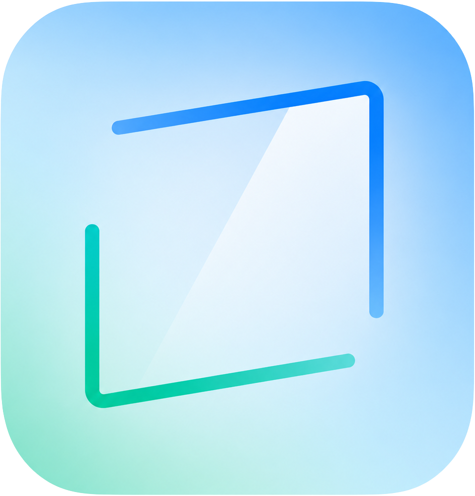
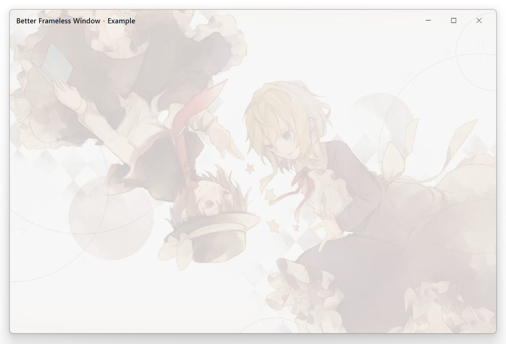
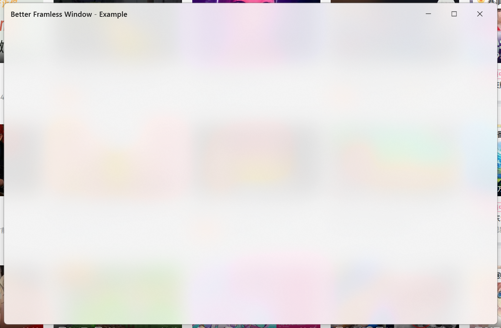

# better-frameless-window

<p align="center">
  
</p>

A Qt6 C++17 frameless window library for Windows with DWM visual effects integration.

## Screenshots

<p align="center">
  
  <br><em>Background image with Cover mode</em>
  <br><br>
  
  <br><em>Acrylic backdrop</em>
</p>

## Features

- **Frameless window** — custom titlebar with icon, drag-to-move, double-click maximize/restore, right-click system menu, Alt+Space shortcut
- **8-direction resize** — HiDPI-aware hit testing with corner detection
- **Background image** — Cover / Fit / Stretch / Tile / Center modes with independent opacity control
- **DWM visual effects** — shadow, rounded corners, system dark mode, Mica / Acrylic backdrop with auto fallback chain
- **Snap Layout** — native DWM hit-test forwarding, toggleable via `setSnapLayoutEnabled()`
- **Theme manager** — Light / Dark with 300ms animated transitions, persistence, and system theme following
- **Titlebar customization** — visibility toggle, adjustable height, widget extension slot
- **Fullscreen support** — auto-hides titlebar, disables resize edges
- **Window geometry persistence** — automatic save/restore with multi-monitor validation

## Requirements

| Component | Minimum |
|-----------|---------|
| Qt | 6.x (Core, Gui, Widgets) |
| CMake | 3.16+ |
| Compiler | MSVC 2022 |
| OS | Windows 10 1809+ (Windows 11 for Mica/rounded corners) |

## Build

```bash
cmake -B build -S .
cmake --build build --config Release
```

The build produces `better-frameless-window.lib` (static library) and `bfw-example.exe`.

## Quick Start

```cpp
#include <QApplication>
#include <QLabel>
#include "framelesswindow.h"

int main(int argc, char *argv[])
{
    QApplication app(argc, argv);

    FramelessWindow window;
    window.setWindowTitle("My App");
    window.setWindowIcon(QIcon(":/icon.png"));
    window.setWindowSizeLimits(QSize(480, 320), QSize());
    window.restoreWindowGeometry();

    auto *label = new QLabel("Hello!");
    label->setAlignment(Qt::AlignCenter);
    window.setCentralWidget(label);

    window.show();
    return app.exec();
}
```

## API Reference

### Window Configuration

| Method | Description |
|---|---|
| `setWindowSizeLimits(min, max)` | Set minimum / maximum window size |
| `minimumWindowSize()` / `maximumWindowSize()` | Get current size limits |
| `setCentralWidget(widget)` | Set the main content widget |
| `centralWidget()` / `takeCentralWidget()` | Get / remove the content widget |
| `setWindowOpacity(qreal)` | Set window-level opacity (0.0–1.0) |
| `windowOpacity()` | Get current window opacity |
| `saveWindowGeometry()` / `restoreWindowGeometry()` | Persist / restore window position and size |

### Titlebar

| Method | Description |
|---|---|
| `setWindowTitle(title)` | Set title text (auto-synced to titlebar) |
| `setWindowIcon(icon)` | Set window icon (displayed in titlebar) |
| `addTitleBarWidget(widget)` | Add a widget to the titlebar center area |
| `clearTitleBarWidgets()` | Remove all titlebar center widgets |
| `setTitleBarVisible(bool)` | Show or hide the entire titlebar |
| `isTitleBarVisible()` | Check titlebar visibility |
| `setTitleBarHeight(int)` | Set titlebar height in pixels (default 44) |
| `titleBarHeight()` | Get current titlebar height |

### Background Image

| Method | Description |
|---|---|
| `setBackgroundImage(pixmap, mode)` | Set background image with display mode |
| `clearBackgroundImage()` | Remove the background image |
| `backgroundImage()` | Get current background image |
| `backgroundImageMode()` | Get current background image mode |
| `setBackgroundOpacity(qreal)` | Set background image opacity (0.0–1.0), blends toward theme color |
| `backgroundOpacity()` | Get background image opacity |

**BackgroundImageMode** — `Cover` (default) / `Stretch` / `Fit` / `Tile` / `Center`

### Visual Effects

| Method | Description |
|---|---|
| `setSystemShadowEnabled(bool)` | Enable / disable system window shadow |
| `isShadowEnabled()` | Check shadow state |
| `setSystemBackdropEnabled(bool)` | Enable / disable system backdrop effects |
| `setSystemBackdropPreference(pref)` | Set backdrop mode |
| `systemBackdropPreference()` | Get current backdrop mode |
| `isSystemBackdropEnabled()` | Check backdrop state |
| `setRoundedCornersEnabled(bool)` | Enable / disable rounded window corners |
| `isRoundedCornersEnabled()` | Check rounded corners state |
| `setSystemDarkModeEnabled(bool)` | Enable / disable system dark mode titlebar |
| `isSystemDarkModeEnabled()` | Check dark mode state |
| `setSnapLayoutEnabled(bool)` | Enable / disable Snap Layout overlay |
| `isSnapLayoutEnabled()` | Check Snap Layout state |

### Theme

| Method | Description |
|---|---|
| `setThemeMode(mode, persist, animated)` | Set Light / Dark theme with optional persistence and animation |
| `themeMode()` | Get current theme mode |
| `setAccentColor(color)` | Set accent color (used in titlebar button hover/pressed) |
| `accentColor()` | Get current accent color |
| `setFollowSystemTheme(bool)` | Auto-follow Windows dark/light setting |
| `followsSystemTheme()` | Check if system theme following is enabled |
| `themeTransitionProgress()` | Get current theme transition progress (0.0–1.0 Q_PROPERTY) |

### Theme Enums

**ThemeMode** — `Light` / `Dark`

**SystemBackdropPreference** — `Auto` / `None` / `Mica` / `MicaLegacy` / `Acrylic`

The `Auto` mode selects the best available backdrop for the current OS:
Windows 11 22H2+ → Mica → MicaLegacy → Acrylic → None

### Diagnostics

| Method | Description |
|---|---|
| `setDiagnosticsEnabled(bool)` | Enable debug logging for DWM / visual effect calls |

## Known Issues

| Issue | Details |
|---|---|
| Snap Layout may not appear | Depends on `HTMAXBUTTON` hit-test forwarding; toggle with `setSnapLayoutEnabled(true)` |
| Resize jitter | Slight visual jitter during active window resize |
| Backdrop flash after restore | Mica/Acrylic may briefly flash after maximize→restore transition |
| Dark mode titlebar | Dark mode may show incorrect background when not maximized |
| Background + backdrop conflict | Background image and Mica/Acrylic are not designed to be used together; clear the image to enable backdrop effects |

## License

MIT
